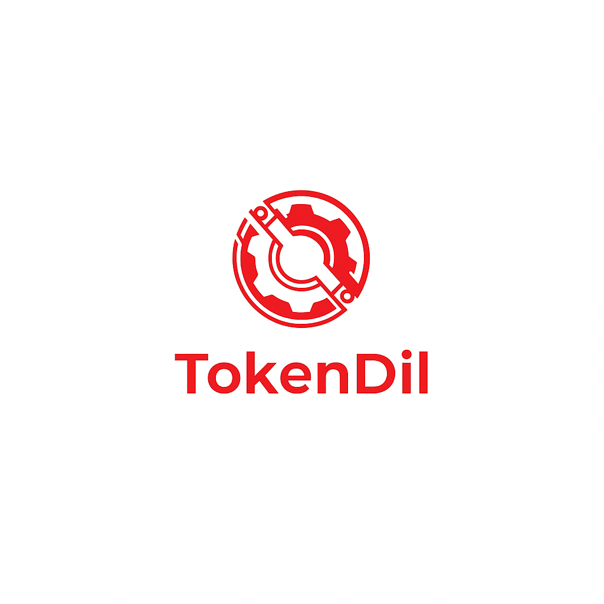

# 🧠 TokenDil - Türkçe Doğal Dil İşleme Takımı

 

## Hakkımızda

**TokenDil**, 2025 yılında Yalova’da kurulmuş, Türkçe Doğal Dil İşleme alanında Milli Teknoloji Hamlesi'ne katkı sağlamayı hedefleyen bir takımdır. Takımımız, dinamik ve yenilikçi projeler geliştirerek Türkçe’nin dijital dünyada daha etkin kullanılmasına öncülük etmeyi amaçlamaktadır.

Doğal dil işleme alanında kamu yararına açık kaynak teknolojiler üretmeyi hedefleyen TokenDil, yerli kaynaklardan ilhamla geliştirilen çözümler sunmayı misyon edinmiştir.

---

## 🎯 Amaç ve Hedefler

- Türkçe diline özel NLP çözümleri geliştirmek  
- Doğal dil işleme alanındaki mevcut eksikleri gidermek  
- Açık kaynak ve kamu yararına kullanılabilir projeler geliştirmek  
- Milli teknoloji vizyonuna katkı sağlamak  

---

## 👥 Takım Üyeleri

| Üye           | Rol                    | Eğitim Bilgisi                                                                 | Github                                           |
|---------------|------------------------|--------------------------------------------------------------------------------|--------------------------------------------------|
| **Aleyna ERKUL** | Takım Kaptanı, Yazılım Geliştirici | Yalova Üniversitesi, Bilgisayar Mühendisliği 4. sınıf öğrencisi |https://github.com/aleynaaley
| **Çağla ÖKMEN**  | Yazılım Geliştirici       | Yalova Üniversitesi, Bilgisayar Mühendisliği Mezunu               |https://github.com/CaglaOkmen |

---

## 🛠️ Kullanılan Teknolojiler

- Python  
- Doğal Dil İşleme Kütüphaneleri (NLTK, spaCy, Hugging Face Transformers vb.)  
- Makine Öğrenmesi ve Derin Öğrenme  
- Git & GitHub

## 📬 İletişim

Geliştirici katkıları, öneriler ya da iş birliği talepleri için bizimle iletişime geçebilirsiniz:

- tokendil77@gmail.com  
- linkedin : https://www.linkedin.com/in/tokendil-team-a00220372/

> TokenDil – Türkçe'ye Değer Kat!
